# Pre-rendering
1. It is a process of rendering html and css in advance in server and then sending it to browser.
2. If we take a example of simple react-app . If you see page source of the react app , you will observe that a single div tag with root id is present.That means a javascript file is sent with the basic html which is responsible for adding the elements in the DOM.
3. But in nextjs if yolu observe page source you will actually see all the html and css elements in it. This happens due to pre-rendering.
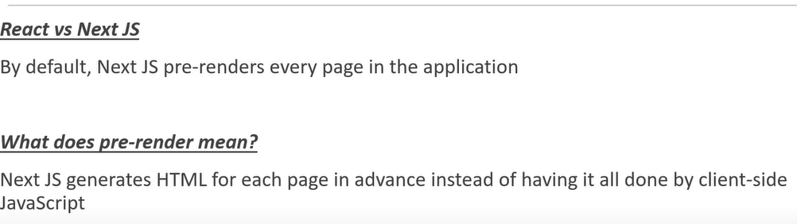   
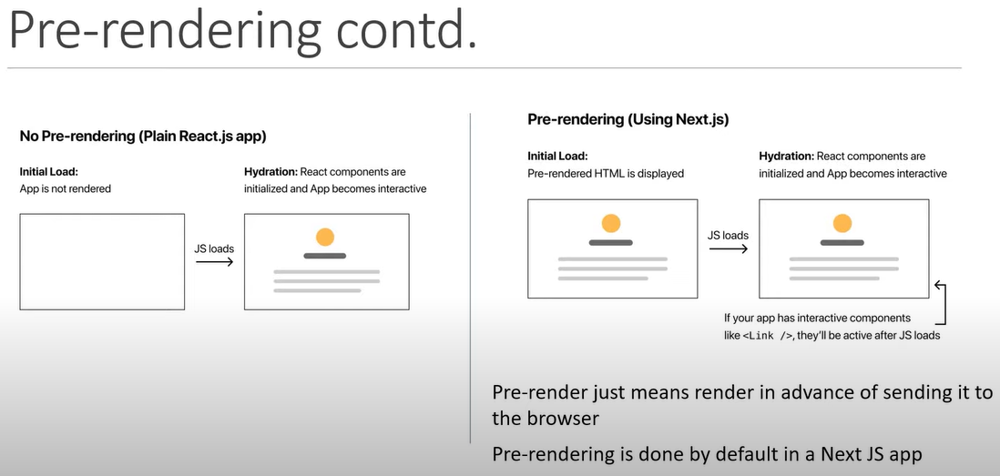   
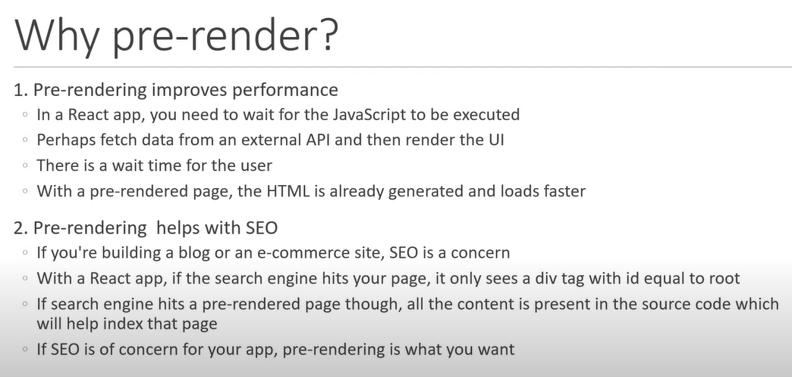   

# Types of  pre-rendering
1. static generation.
2. Server-side Rendering.

# 1. Static generation
1. static generation means that the html is created once at the build time. and then can be given to server or CDN for delivery . Such sites can be very faster. 
2. we do not have to do anything to generate static html . when we build our application static html is generated.
3. At developemt time :- pre-rendering happens after every code changes.
   At preoduction time :- pre-rendering has already happend . that is html is created once when the app was build.

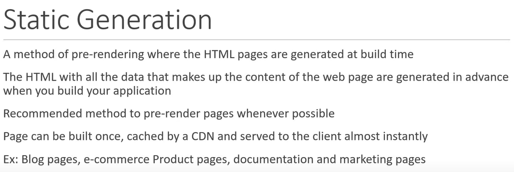   
   
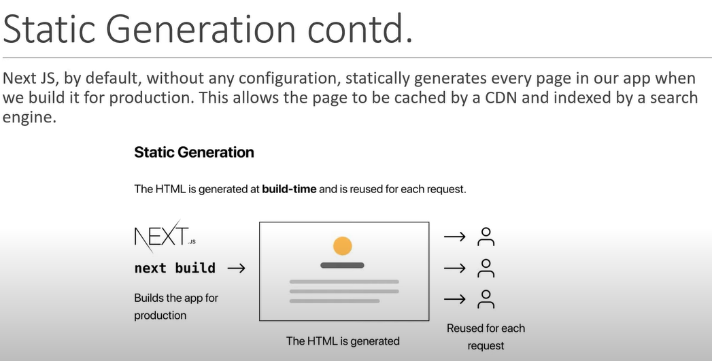   
## Static generation with and without Data.
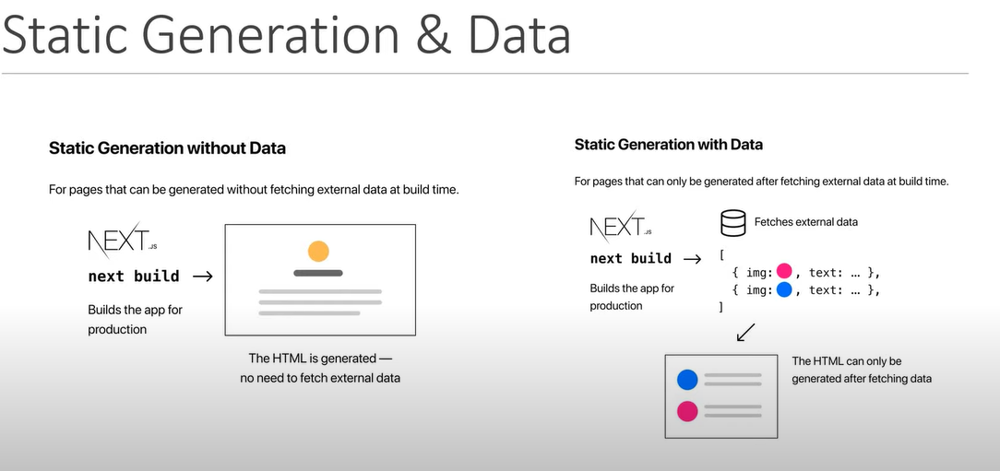   

1. **Static generation without Data**
    1. We do not have to do anything in it . it is automaticaaly generated. as data is not dynamic .so no worry . And we do not need to fetch the data so do not worry.

2. **Static generation with Data** (users.js)
    1. we have to make use of getStaticProps async function . which will be used to fetch the data from external Api .
    2. Make this function in the same file as the component.
    3. It always  returns a object with props object inside it.and pass the props to be passed in the props object.
    4. this function will run on the server and automatically fetches the data and creates a static generated Html and send it to client. the client will recieve a proper pre=rendered data with static dom.
    5. this function will be created at the build time .
    This function will  run at server side and not on client side.

# getStaticProps() in detail

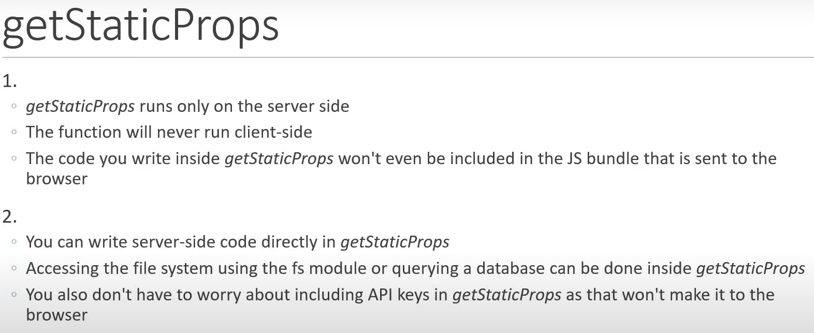
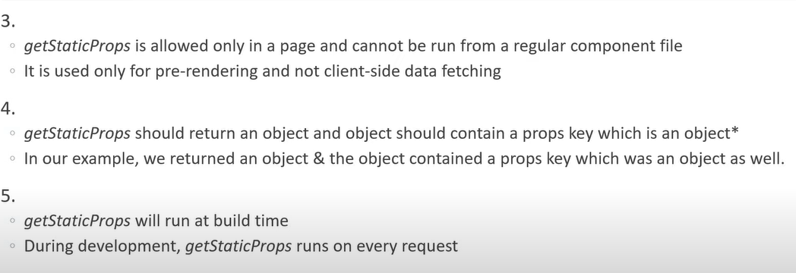   

# what happens when we build an application.
1. .next folder is craeted when we are developing the app.
2. when we run "npm run build" , the same .next folder is created.
3. In terminal you will observe :- 
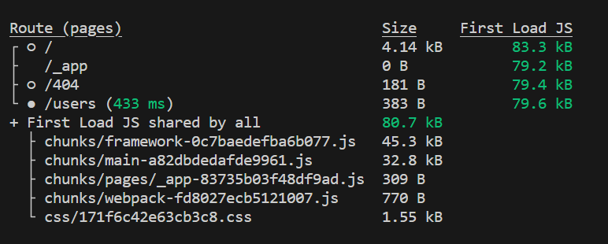   
    1. size :- the amount of the assests downloaded at the client side when that route is hit.
    2. First Load JS :- the amount of the assests downloaded at the server side.
    3. first load js is the bundle which is necessarily downloaded at the first load. which is 80.7 KB.
    4. .next folder have various files.

Important things to remember after build
1. If there a index page and it does not have any link of users. and you navigate to /users by url then you fetch all the prerendered html data from server.
2. But if you have a link on index page of users page then you will even fetch user.json file. so when you will click link then no server reuqest will be made . Then page will be generated dynamically by users.json file and javascript . so it  is client side rendering like reacjs.
3. so using link causes client side rendering which is faster.
4. Link Prefetching
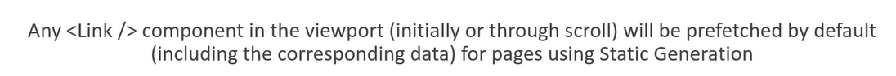
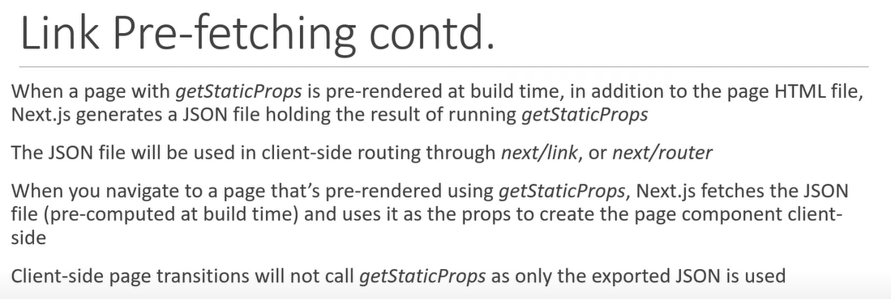
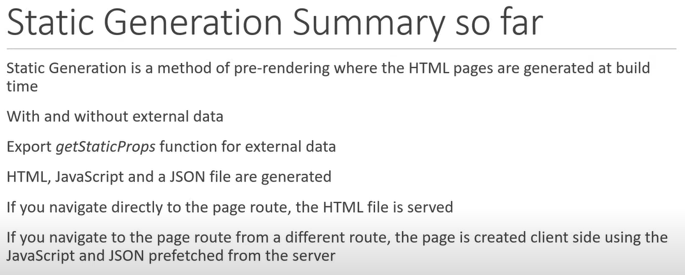