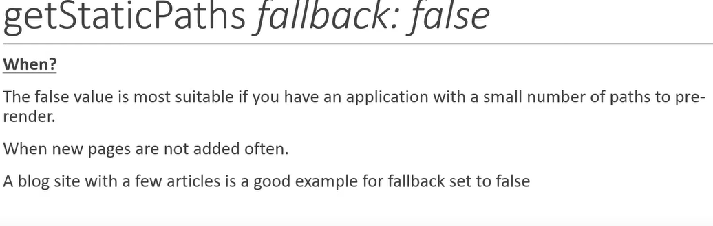

# Pre-rendering
1. It is a process of rendering html and css in advance in server and then sending it to browser.
2. If we take a example of simple react-app . If you see page source of the react app , you will observe that a single div tag with root id is present.That means a javascript file is sent with the basic html which is responsible for adding the elements in the DOM.
3. But in nextjs if yolu observe page source you will actually see all the html and css elements in it. This happens due to pre-rendering.
   
   
   

# Types of  pre-rendering
1. static generation.
2. Server-side Rendering.

# 1. Static generation
1. static generation means that the html is created once at the build time. and then can be given to server or CDN for delivery . Such sites can be very faster. 
2. we do not have to do anything to generate static html . when we build our application static html is generated.
3. At developemt time :- pre-rendering happens after every code changes.
   At preoduction time :- pre-rendering has already happend . that is html is created once when the app was build.

   
   
   
## Static generation with and without Data.
   

1. **Static generation without Data**
    1. We do not have to do anything in it . it is automaticaaly generated. as data is not dynamic .so no worry . And we do not need to fetch the data so do not worry.

2. **Static generation with Data** (users.js)
    1. we have to make use of getStaticProps async function . which will be used to fetch the data from external Api .
    2. Make this function in the same file as the component.
    3. It always  returns a object with props object inside it.and pass the props to be passed in the props object.
    4. this function will run on the server and automatically fetches the data and creates a static generated Html and send it to client. the client will recieve a proper pre=rendered data with static dom.
    5. this function will be created at the build time .
    This function will  run at server side and not on client side.

# getStaticProps() in detail

   

# what happens when we build an application.
1. .next folder is craeted when we are developing the app.
2. when we run "npm run build" , the same .next folder is created.
3. In terminal you will observe :- 
   
    1. size :- the amount of the assests downloaded at the client side when that route is hit.
    2. First Load JS :- the amount of the assests downloaded at the server side.
    3. first load js is the bundle which is necessarily downloaded at the first load. which is 80.7 KB.
    4. .next folder have various files.

Important things to remember after build
1. If there a index page and it does not have any link of users. and you navigate to /users by url then you fetch all the prerendered html data from server.
2. But if you have a link on index page of users page then you will even fetch user.json file. so when you will click link then no server reuqest will be made . Then page will be generated dynamically by users.json file and javascript . so it  is client side rendering like reacjs.
3. so using link causes client side rendering which is faster.
4. Link Prefetching

# static site rendering with dynamic parameter (posts)
1. Here we made a /posts route which have all the posts. on clicking on one of the post we can go to specific post.
2. here we rendered only 3 posts. even inside  getStaticprops() function we can access the postid using content.params.
## getStaticPaths() [postId]
3. Now postId can be anything 1,2,,10390232 . But nextjs says that it should know what can be possible values of postId. so, **getStaticPaths()** function is defined which defines what can be possible values of postId.
# What happens after build ?
4. If we directly call /posts/1 we will be directly given the pre-rendered html page from the server.
5. But lets's see what happen when we click indiwual posts in /posts.
6. when /posts is loaded it automatically loads data of 1,2,3 postId in the form oof json and then run internal js function to add elements in DOM . so this is client side routing and html is prepared at the client side . whereas in the first case html was prepared by the server.

# fallback in getStaticPaths() :- True,false,blocking

## **1. when fallback is false**

    1. html is prepared at build time for specified postid in getstaticPaths() function.
    2. if postid is not predefinde then it would result in 404.

## **2. when fallback is true**

1. so if fallback is true then it will not return 404 no found page when postid is not in getstaticpaths. it will return a component which we will set in page.by using router.isFallback
2. so if there are 3 postid's in the getStaticPaths . then html files of 1,2,3 will be prepared at the build time.
3. But when the user searches for posts/4 then no such html exists then it checks fallback which is set to true therefore it shows the ballback compoennt where here it is "...loading" . After showing that nextjs internally calls getastaticProps and fetch postid-4 and prepares html and json . and after shoing fallback component it shows the real page for posts/4.
4. now if next time posts/4 is searched the same html is returned becausse nextjs also saves the html file which is newly created.

## **3. when fallback is 'blocking'**

1. so this is just similar to fallback-true . just the difference is whenever a new posts /posts/4 is searched it calls the getStaticProps and makes a html for post-4 and then return it. here no fallback state is created so no loading will be observed . So the difference is in true first loading is observed and then real content but in blocking directly real content is shown.

# Something New
