# Pre-rendering
1. It is a process of rendering html and css in advance in server and then sending it to browser.
2. If we take a example of simple react-app . If you see page source of the react app , you will observe that a single div tag with root id is present.That means a javascript file is sent with the basic html which is responsible for adding the elements in the DOM.
3. But in nextjs if yolu observe page source you will actually see all the html and css elements in it. This happens due to pre-rendering.
   
   
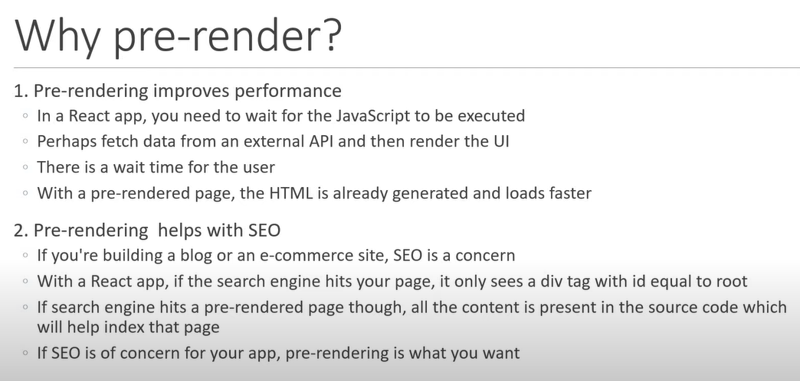   

# Types of  pre-rendering
1. static generation.
2. Server-side Rendering.

# 1. Static generation
1. static generation means that the html is created once at the build time. and then can be given to server or CDN for delivery . Such sites can be very faster. 
2. we do not have to do anything to generate static html . when we build our application static html is generated.
3. At developemt time :- pre-rendering happens after every code changes.
   At preoduction time :- pre-rendering has already happend . that is html is created once when the app was build.

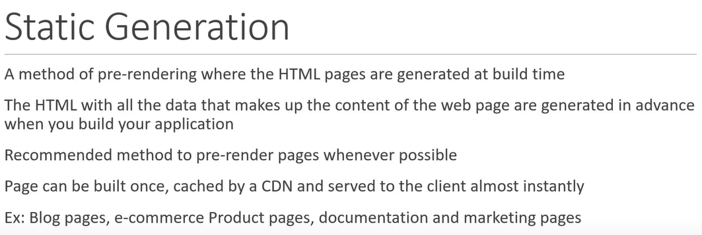   
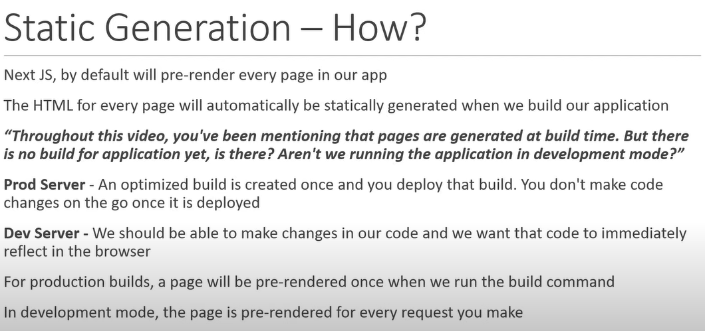   
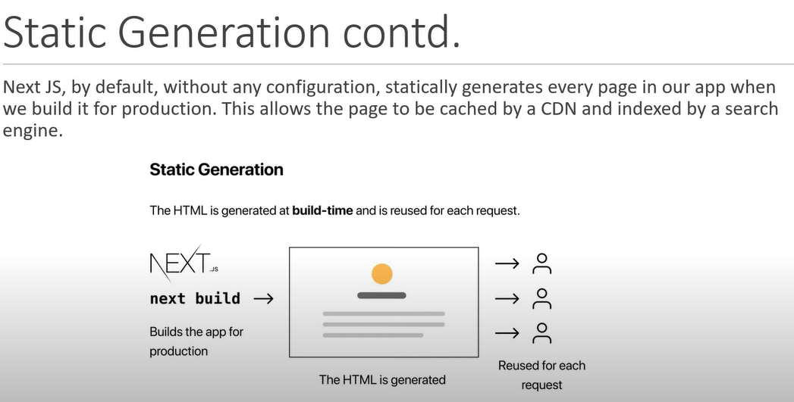   
## Static generation with and without Data.
   

1. **Static generation without Data**
    1. We do not have to do anything in it . it is automaticaaly generated. as data is not dynamic .so no worry . And we do not need to fetch the data so do not worry.

2. **Static generation with Data** (users.js)
    1. we have to make use of getStaticProps async function . which will be used to fetch the data from external Api .
    2. Make this function in the same file as the component.
    3. It always  returns a object with props object inside it.and pass the props to be passed in the props object.
    4. this function will run on the server and automatically fetches the data and creates a static generated Html and send it to client. the client will recieve a proper pre=rendered data with static dom.
    5. this function will be created at the build time .
    This function will  run at server side and not on client side.

# getStaticProps() in detail

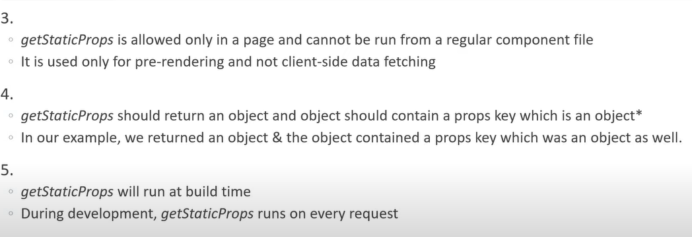   

# what happens when we build an application.
1. .next folder is craeted when we are developing the app.
2. when we run "npm run build" , the same .next folder is created.
3. In terminal you will observe :- 
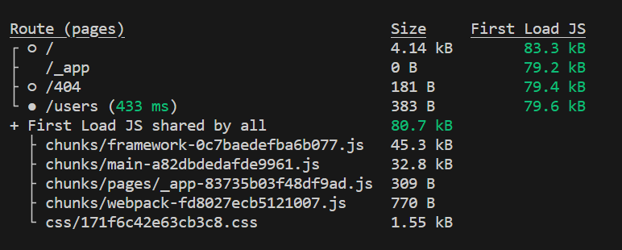   
    1. size :- the amount of the assests downloaded at the client side when that route is hit.
    2. First Load JS :- the amount of the assests downloaded at the server side.
    3. first load js is the bundle which is necessarily downloaded at the first load. which is 80.7 KB.
    4. .next folder have various files.

Important things to remember after build
1. If there a index page and it does not have any link of users. and you navigate to /users by url then you fetch all the prerendered html data from server.
2. But if you have a link on index page of users page then you will even fetch user.json file. so when you will click link then no server reuqest will be made . Then page will be generated dynamically by users.json file and javascript . so it  is client side rendering like reacjs.
3. so using link causes client side rendering which is faster.
4. Link Prefetching

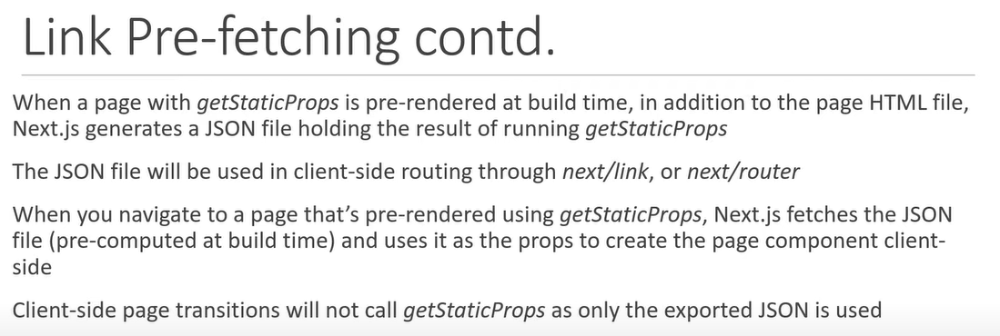

# static site rendering with dynamic parameter (posts)
1. Here we made a /posts route which have all the posts. on clicking on one of the post we can go to specific post.
2. here we rendered only 3 posts. even inside  getStaticprops() function we can access the postid using content.params.
## getStaticPaths() [postId]
3. Now postId can be anything 1,2,,10390232 . But nextjs says that it should know what can be possible values of postId. so, **getStaticPaths()** function is defined which defines what can be possible values of postId.
# What happens after build ?
4. If we directly call /posts/1 we will be directly given the pre-rendered html page from the server.
5. But lets's see what happen when we click indiwual posts in /posts.
6. when /posts is loaded it automatically loads data of 1,2,3 postId in the form oof json and then run internal js function to add elements in DOM . so this is client side routing and html is prepared at the client side . whereas in the first case html was prepared by the server.

# fallback in getStaticPaths() :- True,false,blocking

## **1. when fallback is false**

    1. html is prepared at build time for specified postid in getstaticPaths() function.
    2. if postid is not predefinde then it would result in 404.

## **2. when fallback is true**

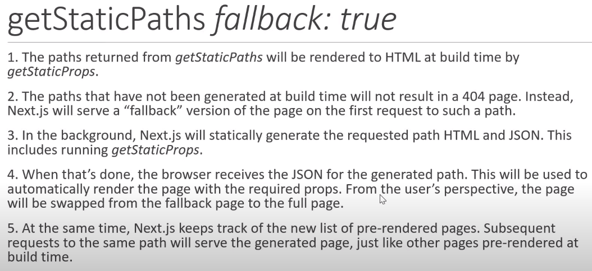

1. so if fallback is true then it will not return 404 no found page when postid is not in getstaticpaths. it will return a component which we will set in page.by using router.isFallback
2. so if there are 3 postid's in the getStaticPaths . then html files of 1,2,3 will be prepared at the build time.
3. But when the user searches for posts/4 then no such html exists then it checks fallback which is set to true therefore it shows the ballback compoennt where here it is "...loading" . After showing that nextjs internally calls getastaticProps and fetch postid-4 and prepares html and json . and after shoing fallback component it shows the real page for posts/4.
4. now if next time posts/4 is searched the same html is returned becausse nextjs also saves the html file which is newly created.

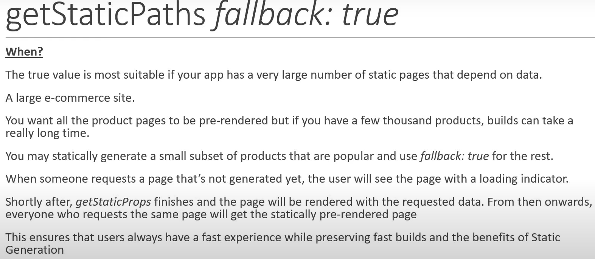

## **3. when fallback is 'blocking'**

1. so this is just similar to fallback-true . just the difference is whenever a new posts /posts/4 is searched it calls the getStaticProps and makes a html for post-4 and then return it. here no fallback state is created so no loading will be observed . So the difference is in true first loading is observed and then real content but in blocking directly real content is shown.

# issues with static Site generation

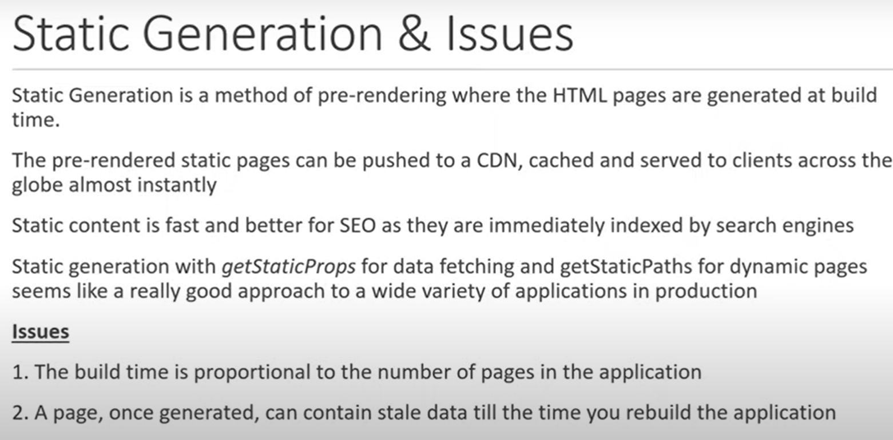

1. The issue is it is static /stale data . lets say we are building a ecommerce app . here at the build time item-1 has price20 dollar and we build the app . now the price is locked . that means a html for theat item is created . so it cannot be changed later . you need to build the entire app again.
2. To solve this problem we need a way to only change the html of the page which we want to change and not the entire app pages.
3. The answer to this question is **Incremental Static Generation**.

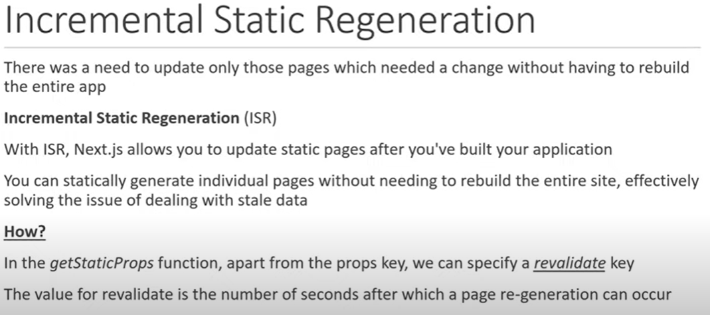

# Incremental Static Generation

1. To do this we need to pass another property in the returning object og getStaticProps function. let's say we set the revalidate to 10 seconds.
2. Now at the intial build the product price is $100 but after after 5 seconds we changed the price to $150 but still for 10 seconds the user will get $100 as the price of product.
3. After 10 seonds if any person-1 searches for that product , getStaticProps function is run and the product price is updated.
4. Imp :- remember even though person-1 searches for that product after 10 seconds the price is still old one . A request is sent for page regeration.so after person-1 anyperson will search for that page will get the update product priece.

5. So it is very clear that it is not like after every 10 seconds the page regeneration is hapenning.
6. page regeneration is happening only when some user searches for it even after revalidation time.
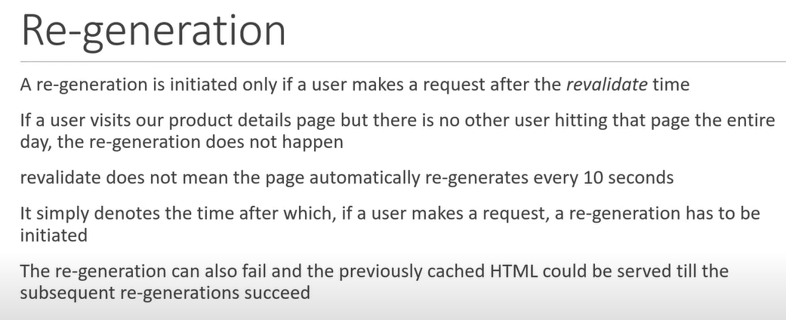
7. Code Example

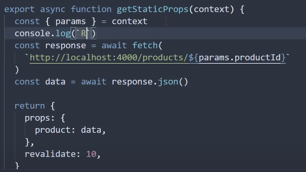

# Problems with Static Generation
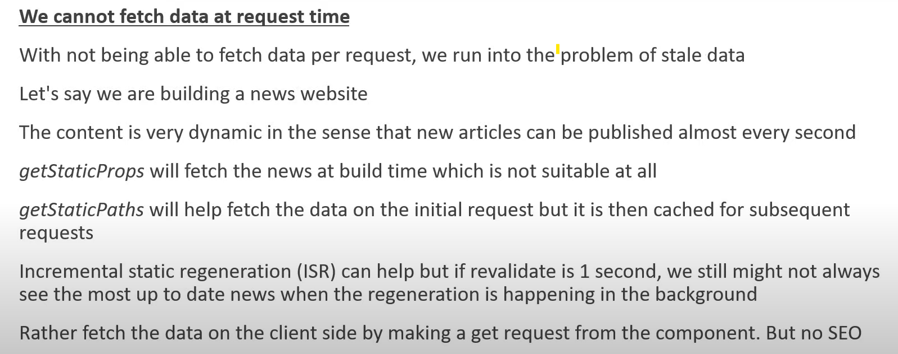
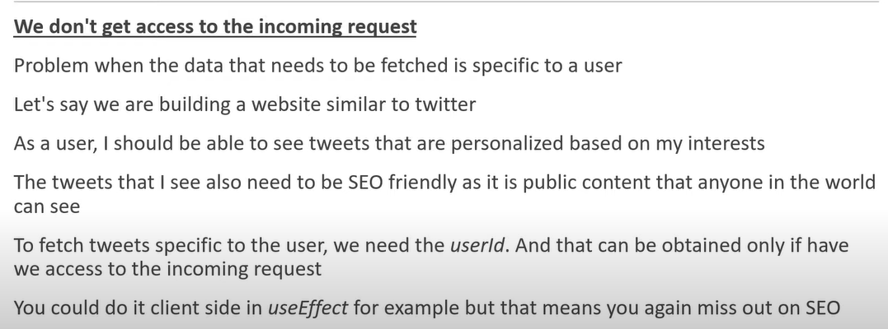

# Server Side Rendering (SSR)

1. whenever the use is requesting for some page the page is fetching data from ecternal api and complte page is created at server side. Use this if necessary.
2. getServerSideProps() fucntion is used same as getStaticProps() .

# getServerSideProps

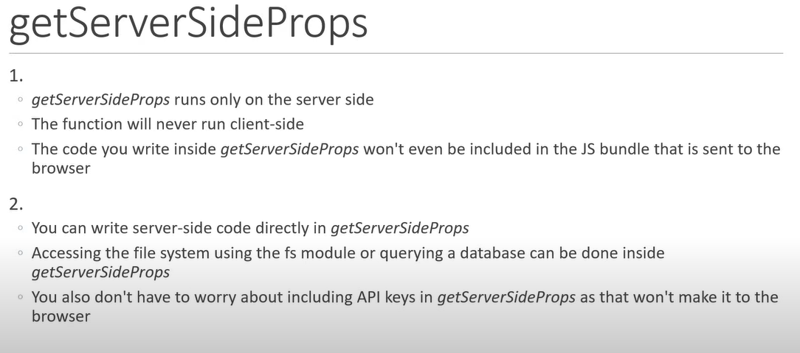

# context inside getServerSideProps() function 
1. params , req, quey , res varoius properties can be extracted from it.
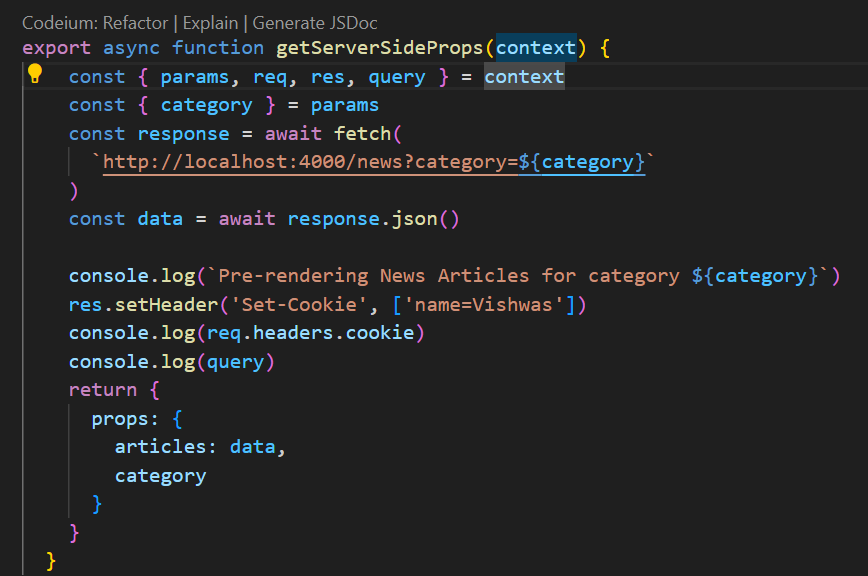

# Client Side Data Fetching (/dashboard)
1. Everytime you do not need prerendering . like for example if user wants to see his dashboard , his followers and all personal information then SEO is not important and we need to skip prerendering because it will not be same for every user.
2. We will use normal useEffect() to fetch the data client side.

(/dashboard-swr)
For **Client Side Data Fetching** we normally use useEffect() to fetch the Data but nextjs suggests to use **SWR** library for data fetching it provide various facilities. (read to understand the working of SWR it's different than useEffect() ).

# server side Pre-rendering and Client-side data fetching (/events)
1. In this we first created a events page which  cconsists of 10 events of varoius categories.
2. we pre-rendered the events page so , the client  got the pre-rendered HTML page from the server.
3. Now we made a button which will fetch only sports events for filtering. this is done on client side.
4. we did server side rendering because there we need SEO of the events and we do not want SEO of the events filtered by particular users .

# shallow Routing
5. Now on clicking the button let's say we want to chenge the url as well.b/c if he reloads all categories will be there even after clicking the button.
6. Shallow routing is done to change the url without fetching any data. So that the data is locked by the url. if you share '/events?category=sports' url to anyone they will be able to open the page which has only sports category.
7. Shallow routing allows you to change the URL without running data fetching methods again, that includes getServerSideProps , getStaticProps , and getInitialProps .